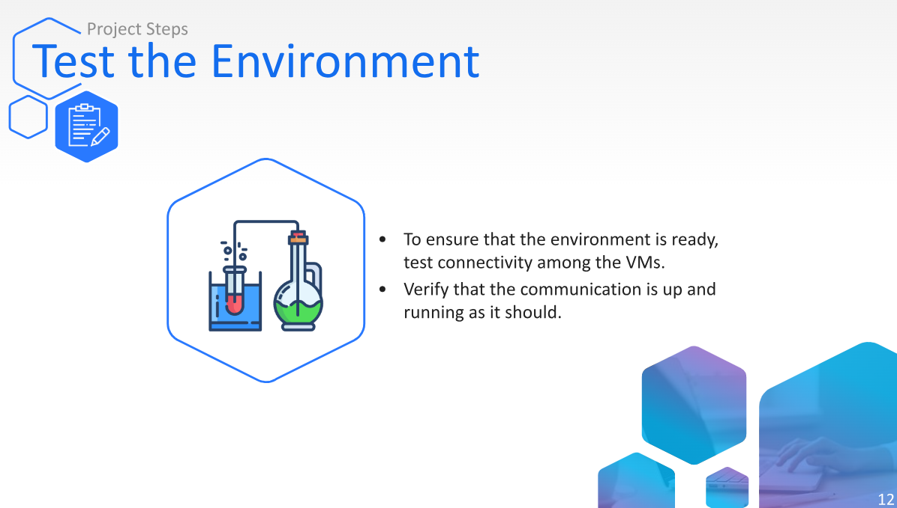
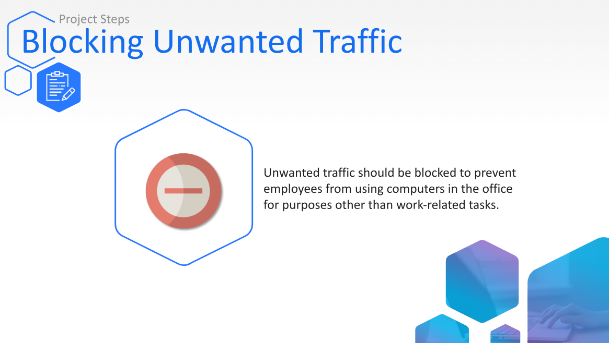
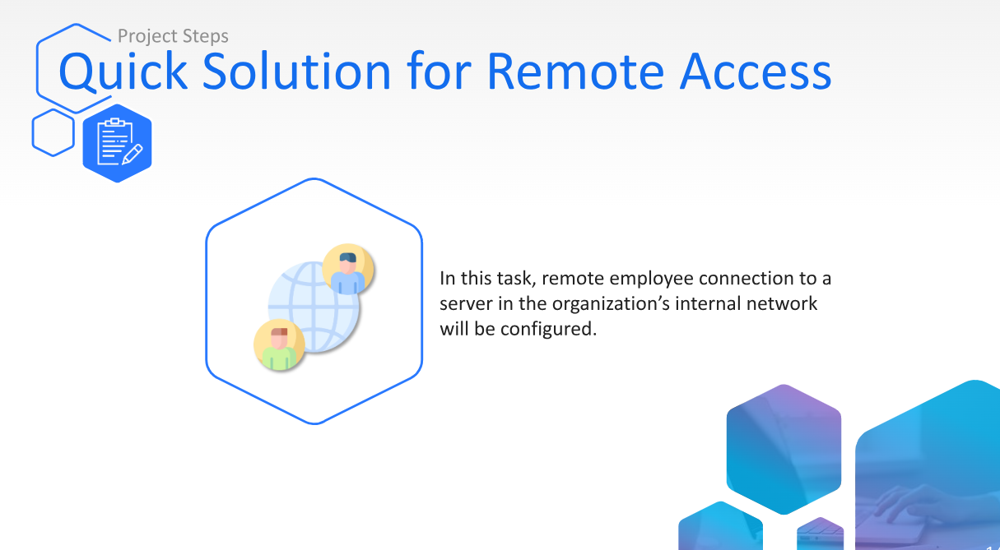
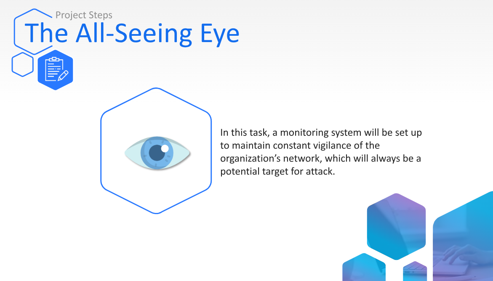

# Securing My Network Lab
## Table of Contents
1. Introduction ( The Scenario )
  
2. Blocking unwanted traffic

3. Quick Solution for Remote Access

4. The All-seeing Eye

# The Scenario
- GoodCorp reached out and made 3 requests to either fit or configure security measures in their network. The entire department/ company is waiting on us to resolve these issues so that GoodCorp may contiune to provide customer services.

- Before moving forward w/ the lab, we will be running 4 different VM's simultaneously, those VM's are Debian, Ubuntua, pfsense, and Kali Linux.

# Task 1

- A primary complaint come from GoodCorp's HR that some employees spend time w/ apps they shouldnt. An employee was caught serveral times playing online games instead of doing his job, so HR manager has requested we block games and get the employee to focus on his job.
- For this task, we've replicated ICMP protocol for gaming, we know web access is import and should be accessible.

- On the ubuntu machine, we log in to pfsense using our LAN ip address.

- So to target this issue, since ICMP = online games what i can do is create a firewall rule blocking traffic the ICMP, and i'll be told to use IP 8.8.8.8 as the destination to be blocked for ICMP. To ensure the rules are properly working, i did one more ping to 8.8.8.8, which we know ICMP being disabled through the firewall rules, doesn't allow us to ping nor send any signals to 8.8.8.8.
# Task 2

- The warehouse manager for GoodCorps requested VPN access for the employees, although the firewall isnt licensed and configured to work as needed, he wants employees to have temporary access, they asked if we could make a web server and SSH service available for connection from remote networks.

- After testing connection from our Debian machine to our ubuntu machine via SSH, replicating the web server and ssh service, i have to go into pfsense and create a NAT port forwarding to translate our external requests SSH to an internal address, HTTP.

- In our firewall settings, we head over to NAT Portforwarding and configure our rules

- Make sure to apply the changes and rules we made, and test that our port forwarding is setup and working correctly.

# Task 3

- The company's CISO decided to implement a detection and prevention system against potential known network attacks. Ive been tasked to implement a mechanism capable of detecting Dos and brute-force attacks and verify that they function correctly.
- To properly set this up we'll need to make sure our firewall is up to date, to work w/ suricata. Suricata is an open-source IDS/IPS.

- After making sure our firewall is up to date, we can know install sucirata and add our detection implementations.

- With our detection messages implemented into our IPS/IDS, we can test this to see if its probably configured and working, by going to our Kali machine and initiating an attack.
- **Brute-Force Attack** = ncrack -p 22 --user ubuntu -P /usr/share/wordlists/rockyou.txt [pfsense WAN
address]

- **DoS Attack** = hping3 -S --flood -V -p 80 [pfsense WAN address]

- 

- Checking our logs on our firewall, we can see that everything is working properly and we got our notifications that there was an attack.
